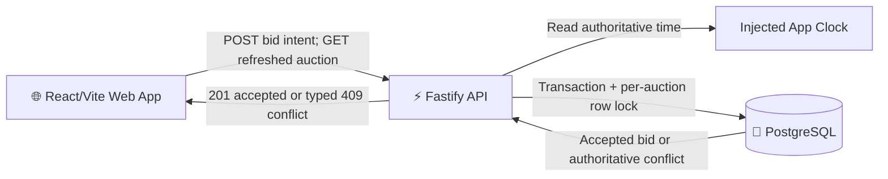
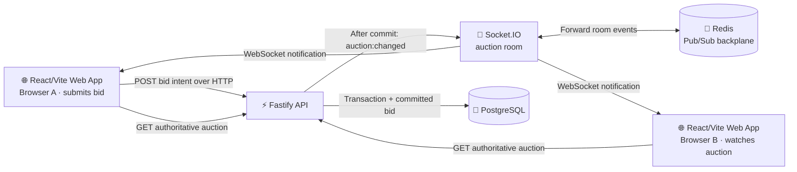

# GRILL.md — Part 4: Realtime auction updates

This document carries forward the agreed bidding and concurrency rules from Part 3 and
records the Part 4 realtime design as it is grilled. Part 4 decisions remain pending until
the grilling session is complete and explicitly confirmed.

## Current-state audit

- The backend already rejects a bid when the auction was closed at validation time, but
  validation and insertion are separate autocommit statements. A bid can therefore pass
  the time check before the deadline and be inserted after it.
- The backend reads the current maximum bid before inserting without a transaction or
  per-auction lock. Concurrent requests can validate against the same stale amount, so
  duplicate bids and bids below another concurrently accepted bid can both be stored.
- The frontend validates against the auction snapshot it originally loaded. When the API
  rejects a stale bid, it displays only the generic error and does not refresh the current
  price, minimum bid, bidder, or bid history.
- A page left open does not rerender when the closing time passes, so its form can remain
  enabled until another render even though the backend rejects the bid.
- The existing headed bidding-war test deliberately reproduces the concurrency defect and
  will need to become a protection test after the behavior is designed.

## Inherited Part 2 decisions

## Actors

- Ten predefined users are seeded in PostgreSQL.
- A new browser tab starts as a randomly selected seeded user. The selection is stored in
  `sessionStorage`, so navigation and reloads within that tab keep the same identity while
  separate tabs can start as different users.
- A small footer switcher can change the active user for the current tab. The header shows
  that user's name.
- There is no authentication. The active user owns auctions they post and cannot bid on
  their own auctions.

## Auctions

- A listing requires title, category, description, condition, location, starting price,
  and a future closing time. The active user supplies seller identity.
- Listings publish immediately. Closing timestamps are stored in UTC.
- Product artwork is selected from the existing category-based illustrations; there are
  no uploads or external image URLs.
- New listings do not accept specifications. The details page hides the specifications
  section when none exist.
- The six existing catalog items are seeded into PostgreSQL and all catalog, search, and
  detail views read through the API.

## Money and bidding

- USD values are stored as integer cents.
- A bid must be at least $1 above the current amount. Ended auctions remain visible but
  reject bids.
- Every accepted bid is stored and shown with bidder, amount, and timestamp.
- Part 2 guaranteed ordinary sequential behavior. Simultaneous-bid locking was deliberately
  deferred to this part.

## Reset behavior

`npm run db:reset` drops only `auction_part_3`, recreates it, applies migrations, and
restores the ten demo users and six original auctions. User-created auctions and bids are
discarded. Normal starts and container restarts preserve data.

## Completed Part 2 delivery slices

1. Database-backed marketplace and persistent user switching.
2. Post an auction as the active user.
3. Place, validate, persist, and inspect bids.

## Part 3 decisions — Round 1

- Bid acceptance is serialized per auction. Equal stale bids cannot both succeed, and every
  accepted bid must meet the minimum relative to the authoritative preceding bid.
- Ideally, when different bid amounts are genuinely simultaneous, the highest bid should
  win. This preference must not introduce disproportionate batching complexity; the exact
  fallback semantics remain open for Round 2.
- Closing eligibility uses an injected application clock so time can be controlled in
  tests. The application clock, not the PostgreSQL clock, is authoritative.
- A stale-bid conflict refreshes the displayed auction state while preserving the bidder's
  entered amount for deliberate revision.
- The frontend never automatically increases or resubmits a bid.
- Bid conflicts use stable machine-readable API error codes and authoritative metadata.
- An open auction page transitions to ended and disables bidding when its local countdown
  reaches zero, while the backend remains authoritative.
- Before realtime support, auction state refreshes after successful bids and conflicts;
  there is no continuous polling.
- Bid-request idempotency keys and replay storage are out of scope to keep the design
  simple.

## Part 3 decisions — Round 2

- Concurrent requests are serialized, not batched. With concurrent $103 and $106 bids on
  a $102 current price, $106 is always the final leader. The $103 bid remains in history
  only if it acquired the lock and was valid before $106 was accepted.
- Bid submission uses a short PostgreSQL transaction and locks the auction row. After the
  lock is acquired, the backend rereads the current maximum bid, reads the injected app
  clock, validates the closing time and minimum, inserts a valid bid, and commits.
- The time read after acquiring the lock is also stored as the accepted bid's `createdAt`.
- Bid conflicts remain HTTP 409 and return a stable `code`, human-readable `error`, and
  authoritative `currentPriceCents`, `minimumBidCents`, and `endsAt` metadata.
- After a stale-bid conflict, the frontend preserves the entered amount and refreshes the
  complete auction. If that read fails, it gracefully retries the auction refresh; it
  never retries or changes the bid itself.
- Successful submission continues to say: “Bid accepted — you are the highest bidder.”
- The auction page schedules a local transition at `endsAt` and recomputes when the tab
  becomes visible. This disables the bid form without continuous backend polling.
- Verification includes deterministic concurrent API tests, injected-clock boundary
  tests, frontend conflict and refresh tests, and conversion of the headed bidding-war
  defect reproduction into a passing protection demonstration.

## Agreed architecture

## Proposed vertical delivery slices

### Slice 1 — Concurrent bidding and stale-bid recovery

**Status: implemented and verified.**

- Serialize bid decisions with a short transaction and per-auction row lock.
- Revalidate the current price after acquiring the lock and return typed conflict metadata.
- Refresh the auction after a stale conflict, preserve the entered amount, retry a failed
  refresh gracefully, and never resubmit the bid automatically.
- Replace the defect-expecting concurrency assertions with deterministic protection tests.
- Browser review: multiple bidders submit stale and simultaneous amounts; accepted history
  stays monotonic, the highest valid amount leads, and rejected bidders recover in place.

Verification completed:

- Backend and frontend Vitest suites pass, including a deterministic delayed-insert race
  that accepts exactly one of three equal simultaneous bids.
- The headed four-window Edge bidding-war protection passes. Its accepted bid history was
  `$101`, `$102`, `$106`, `$107`, with no duplicates; the stale equal bidder retained the
  entered `$102.00` while the view refreshed to the `$103` minimum.
- Both TypeScript workspaces pass strict no-emit typechecking.

### Slice 2 — Authoritative closing and live page transition

**Status: implemented and verified.**

- Inject the app clock and evaluate it after the auction lock is acquired.
- Store the same clock reading as the accepted bid timestamp and reject requests whose
  serialized decision occurs at or after closing.
- Transition an open item page to “Ended” at `endsAt`, recheck on tab visibility, and keep
  the backend authoritative.
- Add deterministic clock-boundary and frontend timer tests and finish the headed
  bidding-war protection demonstration.
- Browser review: leave an auction open through its deadline and attempt boundary bids;
  the form closes on time and no post-close bid is accepted.

Verification completed:

- The backend Vitest suite proves the injected app clock is read after a blocked auction
  lock is acquired, rejects at the exact deadline, and stores the exact injected time for
  an accepted bid.
- The frontend Vitest suite proves the deadline watcher fires at the scheduled boundary
  and recomputes after a backgrounded tab becomes visible.
- The headed four-window Edge protection verifies every bidder page transitions to
  “Ended,” disables its bid button, and shows ended guidance before post-close API attempts
  are rejected with `AUCTION_CLOSED`.
- Backend and frontend suites and both strict TypeScript checks pass.

Both inherited Part 3 slices are implemented and verified.

## Part 4 decisions — Round 1

- Realtime success means an open auction detail page normally updates within one second
  after another bidder's bid is accepted and eventually converges to PostgreSQL's
  authoritative auction state without a manual reload.
- Only auction detail pages receive realtime updates. The homepage and search-result cards
  remain request-time snapshots.
- The supported distribution shape is multiple replaceable API replicas in one region,
  with one Redis server acting as their Socket.IO backplane. Multi-region operation and a
  highly available Redis topology are out of scope.
- Keep the transport and deployment setup simple. Redis-backed inter-server forwarding is
  required, but explicit load-balancer affinity, restrictive-network fallback design, and
  deeper distributed-systems protections are out of scope for this part.
- Bid commands continue through the existing transactional HTTP endpoint. Socket.IO is a
  public, read-only update channel and is never authoritative for bid acceptance.
- PostgreSQL remains authoritative when Redis is unavailable. Valid bids continue to be
  accepted even if realtime propagation is temporarily degraded.
- When simple to support, interrupted clients automatically recover missed updates. If
  recovery is unavailable or uncertain, the client refetches the complete auction through
  HTTP and converges to the authoritative state.
- Any browser may subscribe to a public auction's updates, matching the auction data already
  exposed through REST. Realtime events do not introduce additional bidder information.
- The UI does not show connection-health or realtime-status indicators.
- A multi-replica proxy demonstration and Redis outage demonstration are not part of the
  current delivery. Focused automated tests should still protect the event boundary and
  client refresh behavior.

## Part 4 decisions — Round 2

- Use Socket.IO's ordinary Redis Pub/Sub adapter. Missed packets are not replayed through
  Redis; the browser instead refetches the authoritative auction after every reconnect.
- Configure the browser for WebSocket-only transport. HTTP long-polling fallback and the
  load-balancer affinity it would require are deliberately out of scope.
- Emit an `auction:changed` notification containing the auction slug and accepted bid ID.
  The event is an invalidation signal, not a second source of auction state.
- Each auction detail page joins one public room identified by its validated auction slug
  and leaves that room when it unmounts or changes auctions.
- Publish `auction:changed` only after the bid transaction commits. Rejections, rollbacks,
  and failed transactions do not emit an update.
- The bidder who placed an accepted bid receives the same notification as every other
  auction watcher. The frontend coalesces overlapping refresh requests.
- Redis is a startup dependency. The API must not begin listening until its Redis clients
  are connected, and the normal start command must ensure Redis is running first.
- If a socket-triggered background refresh fails, retain the last good auction snapshot
  without adding connection or refresh status UI. A later event or reconnect tries again.
- Verification covers successful post-commit notification, auction-room isolation, no
  notification for rejected bids, reconnect refetching, refresh coalescing, and a normal
  two-window browser check.
- No proxy, multi-replica harness, or multi-replica demonstration will be added. Redis is
  present as the cross-process backplane without expanding this part into a distributed
  systems exercise.

## Agreed Part 4 architecture

## Proposed Part 4 vertical delivery slices

### Slice 1 — Live auction detail updates

**Status: implemented and verified.**

- Start Redis with the application and require the Redis connection before the API listens.
- Attach Socket.IO and the Redis Pub/Sub adapter to the Fastify server.
- Join auction-specific rooms from WebSocket-only detail-page clients.
- Emit `auction:changed` after an accepted bid commits and coalesce authoritative detail
  refreshes in the browser.
- Protect post-commit emission, rejected-bid silence, room isolation, and the primary client
  update path with focused tests.
- Browser review: open one auction in two windows, place a bid in one, and immediately see
  the current price, bidder, count, minimum, and history refresh in both.

Verification completed:

- Backend tests prove accepted bids publish only after the successful path, rejected bids
  publish nothing, malformed subscriptions are rejected, and auction rooms are isolated.
- Frontend tests prove overlapping invalidations produce at most one in-flight and one
  trailing authoritative refresh, and later events can retry a failed background refresh.
- The full backend and frontend Vitest suites pass, and both TypeScript workspaces pass
  strict no-emit typechecking.
- A headless Microsoft Edge test opens the same auction in two independent browser contexts,
  places a bid in one, and verifies the other updates price, count, bidder, minimum, and bid
  history without reloading.

### Slice 2 — Reconnect convergence and lifecycle hardening

**Status: proposed; awaiting confirmation after Slice 1.**

- Refetch the complete auction after each socket reconnect and retain the last good snapshot
  when a background refresh fails.
- Verify reconnect refetching and refresh coalescing without adding connection-status UI.
- Align Part 4 ports, database names, environment configuration, commands, and local docs so
  the slice is isolated and reproducible.
- Browser review: interrupt one watcher's connection, accept a bid elsewhere, restore the
  connection, and observe the stale watcher converge without a manual page reload.

No multi-replica demonstration is included in either slice.

---

# Part 6: Asynchronous auction close and outcome notifications

Part 6 carries forward the authoritative bidding and realtime behavior above. The following
decisions describe a separate close workflow connected to live outcome notifications through
RabbitMQ. Implementation remains pending until the grilling session is complete, the design
tree has no open branches, and the proposed vertical slices are explicitly confirmed.

## Current-state audit

- An auction currently has an `ends_at` deadline but no durable close outcome or processing
  state. Bid eligibility already ends at the deadline independently of background processing.
- The highest accepted bid is authoritative in PostgreSQL. Socket.IO events only invalidate
  browser snapshots and are not a source of auction or winner state.
- Socket.IO currently uses public auction rooms. Browser identity is a demo-user selection in
  `sessionStorage`, not an authenticated socket identity.
- RabbitMQ is available in the repository's shared Docker Compose stack but Part 6 does not yet
  connect to it or run either background service.

## Part 6 decisions — Round 1

- The auction deadline is the business cutoff for bid eligibility. Background processing later
  records a durable auction close; worker delay never extends the bidding window.
- Closing determines the winner from committed PostgreSQL bid history and records the winning
  accepted bid in the same durable close operation.
- An auction with no accepted bids is still recorded as closed and produces an `AuctionClosed`
  event with no winner. It produces no winner notification, but its seller is still notified.
- RabbitMQ delivery and worker processing are treated as at-least-once. Close processing and
  notification handling must be idempotent so redelivery cannot create another logical
  notification or repeat the modal for a recipient.
- Outcome notifications are live-only. A user who is offline when the event is delivered does
  not receive it on a later visit.
- The outcome appears as a modal overlay and remains open until the recipient explicitly
  dismisses it.
- Every auction seller receives the outcome notification. The winning bidder also receives it
  when the auction has a winner.
- During normal operation, an online recipient should see the modal within five seconds of the
  deadline. After downtime, overdue auctions close promptly when processing resumes.

## Open decisions for Round 2

Worker ownership, message reliability, idempotency boundaries, live identity routing, modal
content and multi-event behavior remain open.

## Part 6 decisions — Round 2

- The Auction Close Worker polls PostgreSQL, records each durable auction close, and publishes
  its `AuctionClosed` integration event through a transactional outbox. The separate
  Notification Worker consumes close events, records idempotent recipient deliveries, and
  emits user-targeted Socket.IO events. The Fastify API continues to own HTTP and browser
  socket connections.
- Idempotency is end-to-end: one close per auction, one outbox event per close, one delivery
  per event and recipient, and one stable notification ID carried to the browser. Each browser
  tab remembers handled IDs and never opens the same notification modal twice.
- Every connected session for a recipient receives the outcome notification. A browser joins
  the selected demo user's Socket.IO room on connection and changes rooms when the active user
  changes. The user ID is validated but remains demo identity rather than authentication.
- Modal copy is recipient- and outcome-specific:
  - Winner: “You won [title] with a bid of [amount].”
  - Seller with winner: “Your auction for [title] ended. [winner] won with [amount].”
  - Seller without bids: “Your auction for [title] ended without any bids.”
- Each modal offers “View auction” and “Dismiss.” Concurrent outcomes queue in deadline order
  and appear one at a time; handling one advances to the next.
- The auction close and its outbox event are inserted in one PostgreSQL transaction so a crash
  between database commit and an initial publication attempt cannot orphan the workflow.
- RabbitMQ support is limited to what the outbox workflow requires: a durable exchange and
  queue, persistent messages, publisher confirms before an outbox row is marked published,
  manual consumer acknowledgements after idempotent handling, and republication of pending
  outbox rows. Retry topology, scheduled backoff, and a dead-letter queue are out of scope.
- The close worker polls every second, claims due auctions in bounded batches with row locking
  and `SKIP LOCKED`, and relies on database uniqueness constraints as the final concurrency
  safeguard.
- A close is authoritative auction state. Auction reads expose `closedAt` and the optional
  winning bid so refreshed pages consistently show the final outcome; the modal is only a
  delivery mechanism.

## Part 6 decision — Final clarification

- Build only the RabbitMQ reliability mechanisms required to make the transactional outbox and
  idempotent consumer work. Do not add dead-letter handling or other generalized messaging
  infrastructure now.

The grilling session is complete. All discovered design branches are settled.

## Agreed Part 6 architecture

```mermaid
flowchart LR
  Browser["🌐 React/Vite Web App<br/>seller or winning bidder"]
  API["⚡ Fastify API<br/>HTTP + user socket rooms"]
  CloseWorker["⏱️ Auction Close Worker"]
  NotifyWorker["🔔 Notification Worker"]
  DB[("🐘 PostgreSQL<br/>auctions, closes, outbox, deliveries")]
  MQ[("🐇 RabbitMQ<br/>AuctionClosed")]
  Redis[("🔴 Redis<br/>Socket.IO backplane")]
  Socket["🔌 Socket.IO<br/>user-targeted outcome event"]

  CloseWorker -->|"Poll due auctions every second"| DB
  CloseWorker -->|"Atomic close + outbox row"| DB
  CloseWorker -->|"Confirmed persistent event"| MQ
  MQ -->|"Manual-ack delivery"| NotifyWorker
  NotifyWorker -->|"Insert recipient delivery once"| DB
  NotifyWorker -->|"Emit stable notification ID"| Redis
  Redis -->|"Forward to API replica"| Socket
  Socket -->|"Dismissible modal"| Browser
  Browser -->|"GET authoritative final outcome"| API
  API -->|"Read auction close"| DB
```

## Proposed Part 6 vertical delivery slices

### Slice 1 — Automatic authoritative auction close

**Status: implemented and verified.**

- Add the durable close model, optional winning-bid reference, and unique close-per-auction
  constraint through an explicit migration.
- Run a separate Auction Close Worker that polls every second, claims due auctions in bounded
  `SKIP LOCKED` batches, selects the committed winning bid, and atomically records the close
  plus one pending `AuctionClosed` outbox event.
- Expose `closedAt` and the optional winning bid from auction reads and render the final outcome
  on the detail page after it closes.
- Protect exact-deadline behavior, no-bid outcomes, winner selection, concurrent workers, and
  one-close/one-outbox idempotency with deterministic tests.
- Browser review: watch auctions with and without bids pass their deadlines and see each detail
  page converge to its authoritative final result without accepting further bids.

Verification completed:

- Backend tests prove exact-deadline eligibility, highest-accepted-bid selection, no-bid
  outcomes, atomic close/outbox creation, repeat-run idempotency, disjoint `SKIP LOCKED`
  claims by competing workers, and final-outcome API serialization.
- Frontend tests prove the detail page refresh begins at the deadline and stops after the
  authoritative close appears.
- The full backend and frontend suites pass, both TypeScript workspaces pass strict no-emit
  typechecking, and the migration applies cleanly to the isolated Part 6 database.
- A headless Microsoft Edge test exercises the running API, Auction Close Worker, and React
  app for both a winning auction and a no-bid auction. Each page converges to the correct final
  outcome and keeps bidding disabled.

### Slice 2 — Live seller and winner outcome modals

**Status: implemented and verified.**

- Publish pending outbox events through the minimum durable RabbitMQ topology, marking them
  published only after publisher confirmation.
- Run the separate Notification Worker, consume with manual acknowledgements, and insert each
  event-recipient delivery once before emitting a stable notification ID through Redis to the
  recipient's Socket.IO user room.
- Join and leave validated demo-user rooms on initial selection and user switching.
- Queue role-specific, dismiss-required modals in the browser, show one at a time, support
  “View auction” and “Dismiss,” and suppress repeated IDs within each tab.
- Protect winner, seller, no-bid seller, redelivery, duplicate socket event, active-user switch,
  multiple-outcome ordering, and all-connected-session behavior with automated tests.
- Browser review: open seller and bidder windows, let an auction close, and see the correct
  modal in every online recipient session exactly once; an unrelated user sees nothing.

Verification completed:

- The outbox publisher asserts the minimum durable exchange/queue topology, publishes
  persistent `AuctionClosed` messages, waits for publisher confirmation, and leaves an event
  pending when confirmation fails.
- The Notification Worker validates the message boundary, manually acknowledges successful
  handling, creates one stable delivery per event-recipient pair, and safely reuses a pending
  ID across the socket-emission crash gap.
- Socket.IO tests prove validated user-room targeting, delivery to every connected session,
  active-user room changes, unknown-user rejection, and unrelated-user isolation.
- Frontend tests prove role-specific winner/seller/no-bid copy, deadline-ordered modal queues,
  duplicate queue suppression, and per-tab handled-ID memory.
- All 21 backend and 15 frontend tests pass, and both TypeScript workspaces pass strict no-emit
  typechecking.
- Three headless Microsoft Edge workflows pass: authoritative winner/no-bid close display,
  the four-session RabbitMQ seller/winner notification path with duplicate redelivery, and the
  inherited live-bid watcher flow.
- The headed four-window Microsoft Edge Bidding War passes against the complete Slice 2 stack.
  Its accepted history was `$101`, `$102`, `$103`, `$104`, `$106`, `$107`, with no duplicate
  amounts; post-deadline `$108` attempts were rejected, and the tiled seller and bidder windows
  were left open on the protected final outcome and recipient modals for review.

Automated backoff, dead-letter handling, offline notification retrieval, seller-only workflows
beyond the close outcome, and production authentication remain outside both slices.
