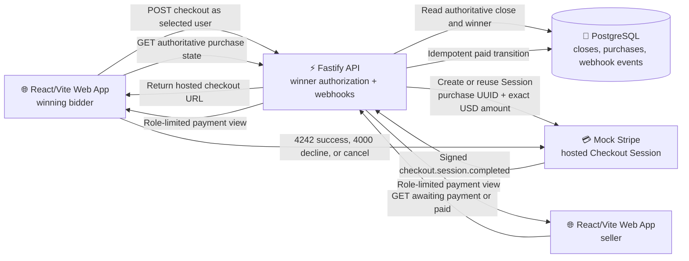

# Part 7: Winner checkout through mock Stripe

Part 7 carries forward Part 6's authoritative auction close, winner selection, RabbitMQ outcome
notifications, and realtime behavior. It adds winner-only payment through the repository's local
`stripe-service/`. This document records the pre-implementation interrogation, the resulting
design, and the verification of both delivered vertical slices.

## Current-state audit

- `part-7-winner-checkout/` began as a copy of `part-6-async-close-rabbitmq/` and retains its
  authoritative close, notification, and realtime bidding behavior.
- Part 6 records one durable auction close with an optional winning accepted bid. The winning
  bidder and exact winning amount are authoritative PostgreSQL state.
- Browser identity remains a selected demo user stored in `sessionStorage`; it is deliberately
  not production authentication.
- Outcome notifications are live-only and dismissible. The winner can also revisit the closed
  auction detail page, so checkout cannot depend exclusively on receiving the notification.
- The root `stripe-service/` is a standalone Fastify service on port `7107`. It creates and hosts
  Stripe-shaped Checkout Sessions, redirects on completion or cancellation, and sends a signed
  `checkout.session.completed` webhook to the Part 7 API on port `3107`.
- Mock Stripe uses `4242 4242 4242 4242` for success and `4000 0000 0000 0002` for decline.
- Mock Stripe currently keeps Sessions in memory. Its dependencies are not installed and it has
  no lockfile, production start script, Dockerfile, or root Compose entry.

## Mock Stripe issues found during grilling

- A completed Session can currently be paid repeatedly, producing a fresh webhook event on every
  attempt.
- Open-Session reuse checks only the purchase reference and silently ignores conflicting amount,
  title, and return URLs.
- Provider state becomes paid only after Auction House accepts the webhook, making payment success
  depend synchronously on merchant availability.
- Webhook delivery has no retry record. Network failures may leave the hosted form stuck in its
  processing state.
- Sessions disappear when the mock service restarts.
- Session creation is unauthenticated, return URLs are unrestricted, and the process listens on
  every interface.
- The hosted page advertises the decline card but not the successful test card.
- The signature is a bare HMAC without Stripe's timestamped signature format or replay window.

The agreed minimal corrections are to prevent repayment of completed Sessions, reuse the same
Session for the same purchase while rejecting conflicting parameters, mark provider state paid
before webhook delivery, retain and redeliver the same event after delivery failure, recover the
hosted form from request failures, and show both test cards. Durable provider storage, API keys,
queues, and a general Stripe emulator remain out of scope.

## Settled product and integration decisions

- Mock Stripe remains a separate local Fastify process and hosted checkout surface. Auction House
  integrates with it over HTTP as an external payment provider.
- The winner starts a Stripe-shaped Checkout Session and is redirected to the provider-hosted page.
  The browser never supplies the authoritative auction, purchase, amount, or currency.
- The total is exactly the winning accepted bid in USD. Shipping, tax, currency conversion,
  discounts, tips, and partial payment are out of scope.
- Only the authoritative winning bidder may initiate checkout, and only after the durable auction
  close exists. Sellers, losing bidders, unrelated users, open auctions, and no-bid auctions are
  rejected server-side.
- Demo identity remains intentionally unauthenticated. Winner enforcement is implemented against
  the selected validated demo user but must not be described as a production security boundary.
- Checkout is reachable from both the winner's outcome modal and a persistent `Complete purchase`
  panel on the closed auction page.
- The hosted mock supports successful payment with `4242 4242 4242 4242`, decline with
  `4000 0000 0000 0002`, and cancellation back to the auction.
- The winner sees `Payment required`, an in-flight processing state, retryable cancellation or
  failure feedback, and `Paid`. The checkout button disables immediately after a click.
- The seller sees only `Awaiting payment` or `Paid`. Other users receive no payment details.
- Successful payment ends this capability. Shipping, fulfillment, refunds, disputes, seller
  payouts, email, and new RabbitMQ notifications are out of scope.

## Settled integrity and recovery decisions

- Auction House lazily creates one durable purchase UUID when the winner first requests checkout.
  A database uniqueness constraint on the auction close makes concurrent clicks converge on the
  same purchase.
- Only a valid `checkout.session.completed` webhook can mark the purchase paid. Browser redirects
  and query parameters are navigation hints, never payment evidence.
- Webhook handling verifies the signature against the raw request body and validates the stored
  purchase UUID, current provider Session ID, exact expected amount, and USD currency before the
  paid transition.
- Webhook event IDs are recorded once. Database constraints also make completion idempotent by
  purchase and provider Session, including different event IDs describing the same completion.
  Valid duplicate deliveries return success without repeating the transition.
- Durable purchase state is deliberately limited to `pending` and `paid`. A card decline remains
  a provider-page attempt. Cancellation is temporary UI feedback and never prevents retry.
- Repeated checkout requests reuse a usable open provider Session. If the in-memory mock restarted
  and lost an unpaid Session, Auction House replaces it for the same pending purchase and stores
  the replacement Session ID.
- Auction House remains the durable source of purchase/payment truth. It does not depend on the
  mock retaining a completed Session after restart.
- After a successful or canceled return, the auction page refetches authoritative purchase state.
  It shows paid only when the API reports paid and never trusts the URL alone.
- No API key is added to the local mock. Part 7 keeps the integration intentionally simple. Winner
  authorization and all authoritative checkout inputs remain responsibilities of Auction House.
- `stripe-service/` remains a sibling at the repository root. It gains a lockfile, and Part 7's
  documented commands explicitly install, start, and verify it through `npm --prefix` commands.

## Agreed architecture

## Part 7 vertical delivery slices

### Slice 1 — Winner completes a replay-safe hosted checkout

**Status: implemented and verified.**

- Copy Part 6 into Part 7 and isolate Part 7's database, API, web, Redis, RabbitMQ, Jaeger, and
  tracing ports while preserving all inherited behavior.
- Add the durable one-per-close purchase model, current provider Session reference, paid timestamp,
  and processed webhook-event records through an explicit migration.
- Add the winner-only create-or-reuse checkout endpoint and construct the exact title, winning bid
  amount, USD currency, purchase UUID, and configured return URLs exclusively on the server.
- Apply the agreed minimal corrections to `stripe-service/`, add its lockfile, document both test
  cards, and run it through Part 7's stable commands.
- Verify signed raw-body webhooks and atomically record the idempotent paid transition only after
  matching purchase, Session, amount, and currency.
- Add `Complete purchase` to the winner's outcome modal and closed-auction page. Disable it on click,
  redirect to hosted checkout, support decline and cancel retry, and render authoritative paid state
  after returning.
- Keep checkout and payment details absent for every ineligible viewer.
- Protect concurrent checkout creation, forged winner/amount/redirect input, conflicting Session
  reuse, completed-Session repayment, invalid signatures, mismatched webhook data, duplicate events,
  cancellation, decline, and success with deterministic tests.
- Browser review: as the winning bidder, launch hosted checkout, observe a decline with the 4000
  card, cancel and retry, then pay with the 4242 card and return to an authoritative paid result.

Verification completed:

- The migration applies cleanly to the isolated Part 7 database and enforces one purchase per
  auction close, one provider Session reference, explicit pending/paid states, and durable webhook
  event IDs.
- Backend tests prove winner-only eligibility, exact authoritative USD amount construction,
  concurrent-click convergence, raw-body signature rejection, webhook field matching, same-event
  and same-Session replay safety, and paid-purchase immutability.
- Mock Stripe tests prove parameter-consistent Session reuse, conflicting-reuse rejection, decline,
  paid-before-delivery behavior, stable-event redelivery, and no second charge after completion.
- Frontend tests prove that checkout sends only the selected demo user and accepts the server-owned
  hosted URL. Browser coverage verifies immediate button disabling and winner-only UI projection.
- All 23 backend, 16 frontend, and 4 Mock Stripe tests pass. All three TypeScript workspaces pass
  strict no-emit typechecking.
- All five headless Microsoft Edge workflows pass: authoritative close, the four-user bidding war,
  seller/winner outcome modals, realtime bid fan-out, and the complete hosted winner checkout.
- The checkout workflow exercises 4000 decline, cancellation and retry, 4242 success, authenticated
  webhook completion, one stored payment event, and the authoritative paid return page.
- A separate unpaid review auction is open in Edge on its $501 hosted checkout page so the flow can
  be evaluated without recreating an auction deadline.

### Slice 2 — Seller visibility and recoverable provider interruptions

**Status: implemented and verified.**

- Expose role-limited purchase state so the seller sees only `Awaiting payment` or `Paid`, while the
  winner retains checkout actions and other users see no payment details.
- Recover an unpaid purchase when Mock Stripe restarts and its stored Session URL is gone by creating
  one replacement Session without creating another purchase or changing the amount.
- Retain and redeliver the same completion event when Auction House is temporarily unavailable,
  without charging again or emitting a new logical provider event.
- Add explicit, retryable winner UI for provider unavailability and prevent rapid repeated clicks
  from producing concurrent browser redirects.
- Protect mock restart replacement, webhook delivery failure/redelivery, winner retry, paid-purchase
  immutability, seller/public data projection, and inherited auction behavior with automated tests.
- Browser review: observe the seller's awaiting-payment state, restart Mock Stripe during an unpaid
  checkout and complete a recovered Session, then see both winner and seller converge to paid while
  an unrelated user sees no payment information.

Verification completed:

- The payment-state endpoint returns a role-specific projection: the seller receives only
  `Awaiting payment` or `Paid`, the winner retains purchase state and checkout actions, and an
  unrelated user is rejected without receiving payment details.
- A pending purchase retrieves its current provider Session before reuse. A provider 404 replaces
  only that missing Session while preserving the purchase UUID and authoritative amount; other
  provider failures return a retryable 503 without replacing the Session.
- Seller and winner pages poll the authoritative API until both converge to paid. The seller never
  receives or renders the amount, purchase identifier, provider Session, or checkout controls.
- Backend coverage includes role projection, missing-Session replacement, provider unavailability,
  webhook replay, and paid-purchase immutability. Browser coverage proves seller awaiting-to-paid
  convergence and absence of payment UI for an unrelated user.
- All 24 backend, 16 frontend, and 4 Mock Stripe tests pass. All three TypeScript workspaces pass
  strict no-emit typechecking.
- Five final Microsoft Edge regression workflows pass: authoritative close, outcome notifications,
  realtime bid fan-out, seller payment visibility, and winner checkout. The separate headed
  four-user Bidding War also passed and its windows remain open on the paid result for review.

Both Part 7 slices are complete and ready for browser evaluation.
