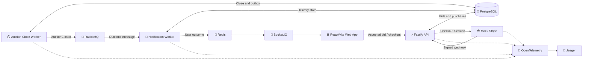

# Auction House — Part 8

```sh
npm install
npm start
```

`npm start` prepares the shared PostgreSQL, Redis, RabbitMQ, and Jaeger containers, migrates
the isolated `auction_part_8` database, and starts the API, Auction Close Worker, Notification
Worker, Mock Stripe, and web app.

- Auction House: <http://localhost:5108>
- Fastify API: <http://localhost:3108>
- Mock Stripe: <http://127.0.0.1:7108>
- Jaeger: <http://localhost:16686>

## Golden trace

The deliberately small trace follows the winning path across real process and time boundaries:



To generate it:

1. Open Auction House, choose a demo user who is not the seller, and place an accepted bid.
2. Let the auction reach its configured deadline. The close notification appears for the winner.
3. Complete winner checkout with `4242 4242 4242 4242`, any valid future `MM / YY`, and a
   three-digit CVC.
4. Open Jaeger, select service `auction-api`, operation `auction.bid.accept`, and run the search.

The trace continues through `auction.close`, `auction.closed.publish`,
`auction.closed.consume`, `winner.checkout.start`, `mock-stripe.checkout.create`,
`mock-stripe.payment.attempt`, and `winner.purchase.mark-paid`.

## Signal policy

- Only named auction, messaging, and checkout operations can begin sampled traces.
- PostgreSQL `SELECT`, `INSERT`, and `UPDATE` spans remain visible under those operations.
- Connection acquisition, transaction-control, health, catalog refresh, worker polling, Redis,
  filesystem, DNS, and framework-internal spans are omitted.
- SQL text, request or response bodies, card data, names, handles, and payloads are not exported.
- Business spans retain auction, bid, event, user, notification, purchase, payment Session,
  amount, role, and outcome identifiers.

The winning bid's W3C `traceparent` is persisted on the auction, close, and outbox records.
RabbitMQ carries it in message headers. Mock Stripe retains it with the in-memory Checkout
Session so the later browser payment attempt and webhook remain in the same trace without
leaving a span open while the system waits.

Use `npm run db:reset` to discard only Part 8 data and restore the seeded demo marketplace.
